# Scroll Container & Header/HUD Architecture — Design Spec

**작성일**: 2026-07-13
**작성자**: 사용자 제공 스펙 원문(아래 "1~6" 섹션은 사용자가 직접 작성해 전달한 프로젝트 표준 스펙 그대로), PM이 배경/Impact만 덧붙임.

## 배경

Step③ 완료 후 Visual Review를 진행하던 중, 사용자가 두 가지를 지적했다:

1. **Header/HUD Pinned Rule**(`docs/history/Decision.md` 참고): 헤더/HUD의 조작 요소(카테고리 드롭다운/계절 드롭다운/밀도 버튼/선택 버튼/⋯더보기/검색)는 각각 독립된 Floating Control이어야 하는데, 지금까지 반복적으로 "하나로 합쳐진 Bar"(`OverlayHeader`)로 회귀해왔다.
2. **Scroll Edge Gradient가 스펙과 다름**: 현재 `FadingScrollEdge`는 스크롤 위치를 전혀 보지 않는 정적 `ShaderMask`이고, 시작 위치도 상태표시줄 바로 아래가 아니라 헤더 아래(그리드 상단)다.

두 문제를 PM이 종합한 결과 — 근본 원인은 화면별 구현 문제가 아니라 **`AppMainScaffold`가 헤더를 `Column`으로 콘텐츠 위에 도킹시키는 구조 자체**였다. 사용자가 이 종합이 맞다고 확인하며 아래 정식 스펙 원문을 전달했다.

---

## 1~6. 스펙 원문 (사용자 작성, 그대로 보존)

# Scroll Container & Scroll Edge Hint Specification (Project Standard)

## 목적

프로젝트의 모든 스크롤 화면은 동일한 스크롤 경험을 제공한다.
스크롤 가능 여부를 알리는 효과는 **Overlay Layer 기반**으로 통일한다.
CSS Mask, ClipPath, ShaderMask 등 콘텐츠 자체를 마스킹하는 방식은 사용하지 않는다.

---

## 1. Scroll Container

모든 Gallery / Detail / Editor 화면은 동일한 구조를 사용한다.

```
Screen
 ├ Background
 ├ Floating Header Layer
 ├ Scroll Container
 ├ Top Gradient Overlay
 ├ Bottom Gradient Overlay
 └ Floating Buttons
```

### Layout Rules

* Header는 항상 **position:absolute**(Overlay Layer)
* Header는 Scroll Container의 레이아웃 공간을 차지하지 않는다.
* Scroll Container는 화면 전체를 차지한다.
* 실제 콘텐츠 시작 위치는 Scroll Container 내부의 Spacer가 결정한다.
* Status Bar(OS 영역)는 앱 레이아웃 계산에서 제외한다.

---

## 2. Scroll Edge Hint (공통 규칙)

스크롤 가능 여부는 **Overlay Gradient Layer** 두 개로 표현한다.
사용 방식은 프로젝트 전체에서 동일하다.

```
Stack
 ├ Scroll Content
 ├ Top Gradient Overlay
 └ Bottom Gradient Overlay
```

Gradient는 콘텐츠를 마스킹하지 않는다.
항상 Overlay Layer로 존재한다.

---

### Top Gradient

```
position: absolute
top = Content Start
left = 0
right = 0
height = 40px
```

```
linear-gradient(
    to bottom,
    BackgroundColor 0%,
    transparent 100%
)
```

Opacity

```
0.85
```

표시 조건

```
scrollTop > 2px
```

즉, 스크롤을 조금이라도 내렸다면 표시한다. 최상단에서는 숨긴다.

```
opacity 0 ↔ 0.85
transition opacity .3s ease
```

---

### Bottom Gradient

```
position: absolute
bottom = 0
left = 0
right = 0
height = 48px
```

```
linear-gradient(
    to top,
    BackgroundColor 0%,
    transparent 100%
)
```

Opacity

```
0.85
```

표시 조건

```
scrollTop < scrollHeight - clientHeight - 2px
```

즉, 아래로 더 스크롤 가능한 경우에만 표시한다. 맨 아래에서는 숨긴다.

```
opacity 0 ↔ 0.85
transition opacity .3s ease
```

---

## 3. Scrollbar

Scrollbar는 레이아웃 공간을 예약하지 않는다.
콘텐츠 위에 Overlay로 표시된다.
항상 HUD처럼 동작한다.

```
평상시 → Opacity 0
사용자가 Scroll 시작 → Fade In
Scroll 종료 후 일정 시간 → Fade Out
```

스크롤바 때문에 Gallery Tile이나 Card의 가로 폭이 줄어들어서는 안 된다.

---

## 4. Content Spacer

Spacer는 Header 높이만큼만 확보한다.
Spacer만 화면마다 달라질 수 있다.

---

## 5. AI Constraints

다음 구현은 금지한다.

❌ CSS Mask를 이용한 Scroll Hint
❌ ShaderMask 기반 Fade
❌ Header가 레이아웃 공간을 차지하는 구조
❌ Scrollbar를 위한 우측 Padding 추가
❌ 화면마다 다른 Scroll Hint 방식
❌ Scrollbar 때문에 콘텐츠 폭이 줄어드는 구조

---

## 6. Flutter Implementation Contract

Flutter 구현은 다음 구조를 기준으로 한다.

```
Stack
 ├ ScrollView
 ├ TopGradientOverlay
 ├ BottomGradientOverlay
 ├ ScrollbarOverlay
 ├ FloatingHeader
 └ FloatingButtons
```

* Header와 Floating Buttons는 ScrollView와 독립된 Overlay Layer이다.
* Gradient Overlay와 Scrollbar Overlay는 콘텐츠를 가리지 않고 그 위에 배치된다.
* ScrollView는 화면 전체를 사용하며, 콘텐츠 시작 위치는 내부 Spacer로만 조절한다.
* 모든 Gallery / Detail / Editor 화면은 동일한 Scroll Container를 재사용한다(`AppScrollContainer` 등 공용 위젯).

---

## PM Addendum — 이 프로젝트 코드베이스 매핑 (Flutter 용어 대응)

사용자 스펙의 웹/CSS 용어를 이 프로젝트의 실제 Flutter 코드에 대응시킨 것. 스펙 본문(위 1~6)은 원문 그대로 두고, 아래는 "무엇을 고쳐야 하는가"에 대한 PM 판단만 추가한다.

| 스펙 용어 | 현재 이 프로젝트 코드 | 대응 방침 |
|---|---|---|
| `position:absolute` Header | `AppMainScaffold`가 `Column`으로 `OverlayHeader`를 body 위에 도킹 | `AppMainScaffold`를 `Stack` 기반으로 재설계, Header를 `Positioned`(top)로 전환 |
| Header가 레이아웃 공간을 차지하지 않음 | 현재 `Column`이라 공간을 차지함(그래서 body가 밀림) | Stack 전환으로 자동 해결 |
| Content Spacer | 없음(Column이 알아서 배치) | Scroll Container 내부 상단에 Header 높이만큼의 `SizedBox` 추가 |
| ShaderMask 기반 Fade (금지) | `lib/widgets/fading_scroll_edge.dart` — 정확히 이 금지된 패턴 | **폐기**, `TopGradientOverlay`/`BottomGradientOverlay`(스크롤 위치 기반 조건부 표시)로 교체 |
| Scrollbar Overlay | 미착수(`docs/work/BACKLOG.md` 파킹로트) | 이번 스코프 아님 — 구조만 자리를 만들어두고 실제 구현은 별도 태스크 |
| Floating Header 내부 각 컨트롤 | `OverlayHeader`가 단일 `Container`+`Row`로 병합(Pinned Rule 위반) | 분해해 각각 독립된 `Positioned` 글래스 pill/circle로 재구성 |
| `AppScrollContainer` 등 공용 위젯 | 없음 | 신설 — Gallery/Detail/Editor 전 화면이 공유할 예정(Detail/Editor는 Step④~⑤ 몫이라 지금은 계약만 맞추고 실제 적용은 나중) |

## Impact (착수 전 평가, Workflow_Project.md §7 / Workflow_Design.md §10)

- **영향 범위**: `lib/widgets/app_main_scaffold.dart`(Column→Stack 재설계), `lib/widgets/overlay_header.dart`(폐기 또는 완전 재작성), `lib/widgets/fading_scroll_edge.dart`(폐기), `lib/widgets/category_toggle_dropdown.dart`(독립 floating pill로 재포장 여부 검토) — 공유 셸이라 옷장/코디/스타일일지 메인 3화면 전부 자동 영향.
- **회귀 위험**: 기존 통합테스트(`closet_main_screen_test.dart` 32개, `app_main_scaffold_shell_migration_test.dart`, `composition_style_log_main_screen_test.dart` 등)가 현재 Column 기반 위젯 트리 구조(`OverlayHeader` 존재, `FadingScrollEdge` 존재)를 전제로 finder를 쓰고 있어 다수 깨질 것으로 예상 — Worker가 구조 변경과 함께 테스트도 갱신해야 함.
- **스코프 경계**: 이번 스펙은 헤더/HUD 배치 구조 + 스크롤 그라디언트만 다룬다. 옷장 메인 주문서에 함께 포함된 **선택 모드(다중 선택/삭제→휴지통/토스트+실행취소)** 는 실제 상호작용·데이터 흐름이 필요한 별도 스코프(Step⑦ 성격)로, 이 태스크에 포함하지 않고 후속 태스크로 분리한다.
- **Scrollbar 실제 구현**: 이 스펙의 §3/§6이 계약(Overlay, 레이아웃 비침습)을 정의하지만, 실제 Scrollbar 위젯 제작은 BACKLOG 파킹로트에 남겨두고 이번 스코프에 넣지 않는다 — 구조상 나중에 끼워 넣을 자리만 확보한다.

## Class Diagram (구조 확정 후 기록)

`lib/widgets/` 아래 이 스펙을 구현하는 위젯들의 실제 합성(composition) 관계. `AppMainScaffold`/`AppScrollContainer`는
필드 타입상 `Widget`을 받는 슬롯이라, 슬롯 자체는 어떤 위젯이든 채울 수 있지만 Header/HUD Pinned Rule을 만족하려면
실제로는 `GlassPill`/`GlassCircleButton`(또는 그 어댑터)만 채워야 한다 — 아래 다이어그램은 그 "슬롯 계약"과 "화면들이
실제로 채우는 값" 둘 다 표시한다.

```mermaid
classDiagram
    class AppMainScaffold {
      +AppCategory current
      +Widget body
      +bool showBackButton
      +bool showCategoryToggle
      +List~Widget~ headerActions
      +List~Widget~ secondaryControlsLeft
      +List~Widget~ secondaryControlsRight
      +Widget groupingBar
      +double groupingBarHeight
      +Widget floatingActionButton
      +double statusBarHeight$
      +double controlHeight$
      +contentSpacerHeight()$ double
    }

    class AppScrollContainer {
      +builder(BuildContext, ScrollController) Widget
    }

    class TopGradientOverlay {
      +bool visible
      +double height$
    }

    class BottomGradientOverlay {
      +bool visible
      +double height$
    }

    class GlassPill {
      +Widget child
      +EdgeInsetsGeometry padding
    }

    class GlassCircleButton {
      +IconData icon
      +VoidCallback onTap
      +String tooltip
    }

    class CategoryToggleDropdown {
      +AppCategory current
    }

    class FrostedBackButton {
      +VoidCallback onTap
    }

    class ClosetMainScreen
    class CompositionMainScreen
    class StyleLogMainScreen
    class ClosetItemDetailScreen
    class CompositionDetailScreen
    class StyleLogViewerScreen

    class EditorHeader {
      <<미마이그레이션>>
      +VoidCallback onCancel
      +VoidCallback onHelpTap
    }

    AppMainScaffold *-- CategoryToggleDropdown : showCategoryToggle=true 시 내부 생성
    AppMainScaffold *-- FrostedBackButton : 뒤로가기 표시 조건 충족 시 내부 생성
    AppMainScaffold ..> AppScrollContainer : body 슬롯(전형적 채움)
    AppMainScaffold ..> GlassPill : headerActions/secondaryControlsLeft 슬롯(전형적 채움)
    AppMainScaffold ..> GlassCircleButton : secondaryControlsRight 슬롯(전형적 채움)

    AppScrollContainer *-- TopGradientOverlay
    AppScrollContainer *-- BottomGradientOverlay

    CategoryToggleDropdown *-- GlassPill : 항상 감쌈
    FrostedBackButton *-- GlassCircleButton : 항상 감쌈

    ClosetMainScreen ..> AppMainScaffold : build()
    CompositionMainScreen ..> AppMainScaffold : build()
    StyleLogMainScreen ..> AppMainScaffold : build()
    ClosetItemDetailScreen ..> AppMainScaffold : build()
    CompositionDetailScreen ..> AppMainScaffold : build()
    StyleLogViewerScreen ..> AppMainScaffold : build()

    note for AppMainScaffold "Header/HUD Pinned Rule(docs/history/Decision.md): headerActions/secondaryControlsLeft/secondaryControlsRight/groupingBar는 각각 독립 Positioned이며 하나의 Row/Container로 병합하지 않는다."
    note for AppScrollContainer "builder가 만든 스크롤 위젯에 연결한 ScrollController를 관찰해 scrollTop으로 TopGradientOverlay/BottomGradientOverlay의 visible을 계산한다(스펙 §2)."
    note for ClosetMainScreen "슬롯: headerActions=[GlassPill+선택 버튼], secondaryControlsLeft=[GlassPill+계절 Dropdown], secondaryControlsRight=[GlassCircleButton 밀도, GlassCircleButton(미정 스텁)], groupingBar=skeletonRegion, body=AppScrollContainer+GroupedGalleryGrid."
    note for CompositionMainScreen "슬롯: headerActions=[GlassPill+선택 버튼], secondaryControlsLeft=[GlassPill+계절 Dropdown], secondaryControlsRight=[GlassCircleButton 밀도, GlassCircleButton 정렬], groupingBar=skeletonRegion, body=AppScrollContainer+CompositionGalleryGrid."
    note for StyleLogMainScreen "슬롯: headerActions=[GlassPill+선택 버튼], secondaryControlsRight=[GlassCircleButton 정렬], groupingBar/secondaryControlsLeft 없음(플랫+필터형), body=AppScrollContainer+StyleLogGalleryGrid."
    note for ClosetItemDetailScreen "Step④(2026-07-14) 완료. 슬롯: headerActions=[GlassCircleButton ⋯더보기](CategoryToggleDropdown은 showCategoryToggle 기본값으로 Scaffold가 자동 배치), secondaryControlsLeft/Right·groupingBar 없음, body=AppScrollContainer+skeletonRegion(본문)+CrossReferenceLinkBar(placeholder entry 1개). 옛 DetailHeaderActions composite 위젯은 삭제됨(TechnicalDebt.md 해소 기록 참고) — CompositionDetailScreen/StyleLogViewerScreen도 동일 구조."
    note for CompositionDetailScreen "ClosetItemDetailScreen과 동일 구조(위 노트 참고), current=AppCategory.composition."
    note for StyleLogViewerScreen "ClosetItemDetailScreen과 동일 구조(위 노트 참고), current=AppCategory.styleLog."
    note for EditorHeader "아직 AppMainScaffold와 연결되지 않고, GlassPill/GlassCircleButton도 쓰지 않는 원시 TextButton/IconButton 구현이다. 2026-07-14 PM/사용자 확인으로 Pinned Rule 적용 대상이 아님을 확정(docs/history/TechnicalDebt.md 해소 기록 참고) — 목업(코디 제작 화면.txt)이 이 헤더를 '고정 불투명 앱바'로 명시해, 원시 스타일 유지가 의도된 예외. Step⑤는 이 헤더를 그대로 3개 Add/Create 화면에 연결한다."
```


